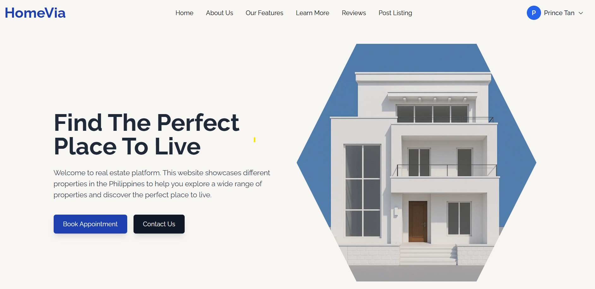

<h1 align="center"> HomeVia</h1>

<p align="center">
  <strong>Real Estate Management System</strong>
</p>

<p align="center">
  


</p>

---

## 📖 About

HomeVia is a modern real estate platform built with React, Tailwind CSS, and Firebase. It showcases properties in the Philippines, helping users explore and discover their perfect place to live.

### ✨ Key Features

- 🔐 **Authentication** - Secure login and registration
- 📝 **Property Management** - Create, edit, and delete listings
- 🖼️ **Image Gallery** - Multi-image upload with viewer
- 👤 **User Dashboard** - Personal property management
- 🌐 **Public Listings** - Browse properties without login
- 📱 **Responsive Design** - Works on all devices
- 🔥 **Real-time Updates** - Live data with Firebase

---

## 🚀 Quick Start

```bash
# Clone the repository
git clone https://github.com/lowish/My_Real_Estate.git
cd My_Real_Estate

# Install dependencies
npm install

# Configure Firebase
cp .env.example .env
# Add your Firebase credentials to .env

# Run development server
npm start

# Build for production
npm run build
```

---

## 🛠️ Tech Stack

- **Frontend:** React 18, Tailwind CSS, Framer Motion
- **Backend:** Firebase (Auth, Firestore, Storage)
- **Routing:** React Router v7
- **UI Components:** Headless UI, Heroicons

---

## 📁 Project Structure

```
My_Real_Estate/
├── src/
│   ├── components/
│   │   ├── pages/        # Page components
│   │   └── ui/           # Reusable UI components
│   ├── firebase/         # Firebase configuration
│   └── services/         # API services
├── public/
├── .env.example          # Environment template
└── package.json
```

---

## 🔒 Security

- Environment variables are git-ignored (`.env`)
- Firebase security rules configured
- Protected routes for authenticated users
- User-specific data access only

---

## 👨‍💻 Author

**lowish**
- GitHub: [@lowish](https://github.com/lowish)

### Original Project
Based on the original work by [Prince Tan](https://github.com/TheMostafax)

---

## 📝 License

MIT License - See [LICENSE](LICENSE) file

---

<div align="center">

Made with ❤️ by lowish

</div>

